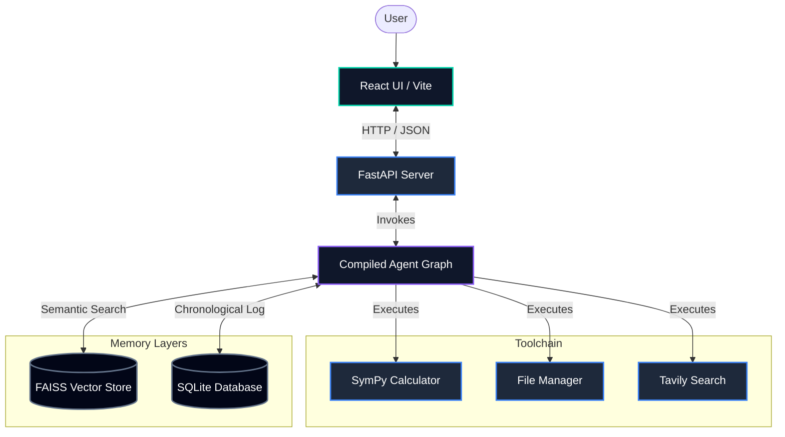

# Telemetric ReAct Engine: Autonomous Agent with Hybrid Episodic Memory

A state-of-the-art ReAct-based agent featuring deep-reasoning telemetry and dual-tier vector-relational episodic memory.

[](https://python.org)
[](https://langchain.com)
[](https://groq.com)
[](https://vercel.com)
[](https://opensource.org/licenses/MIT)
[](https://github.com/Rodina404/Autonomous-AI-Agent/actions/workflows/ci.yml)

---

## Demo

🔗 [Live Client (Vercel)](https://autonomous-ai-agent-z6f4.vercel.app/) · 🔗 [Backend API (Railway)](https://autonomous-ai-agent-production.up.railway.app/api/health) · 📹 [Demo Video](file:///C:/Users/rodin/Downloads/finedemo1.mp4)

The live interface provides real-time access to the agent. Users can send complex queries and inspect the step-by-step reasoning logs, active tools, and memory states generated by the agent during execution.

---

## What Makes This Different

* **ReAct Reasoning Loop**: Instead of simple prompt chains, the agent dynamically decides tool invocation sequences, evaluates observations, and loops autonomously until a resolution is reached.
* **Hybrid Episodic Memory**: Combines FAISS semantic similarity vector stores for matching context with SQLite chronological logs to retain history across sessions.
* **Telemetry Interface**: Redesigned developer console showing full reasoning traces, raw tool inputs/outputs, and live API connection status for auditability.
* **Honest Limitation**: Single-thread memory context; episodic memory does not perform multi-session cross-entropy comparison or fact-consolidation yet.

---

## Architecture



---

## Quick Start (5 Commands)

To run the application locally, execute the following commands:

```bash
# 1. Clone the repository and navigate into it
git clone https://github.com/Rodina404/Autonomous-AI-Agent.git && cd Autonomous-AI-Agent

# 2. Set up virtual environment and install backend packages
python -m venv venv; ./venv/Scripts/activate; pip install -r agent_project/requirements.txt

# 3. Start the backend API server
cd agent_project; python -m uvicorn api:app --reload --port 8000

# 4. Install frontend npm packages (in a separate terminal)
cd agent_UI; npm install

# 5. Run the frontend development console
npm run dev
```

---

## Environment Variables

Configure these variables inside `agent_project/.env`:

| Variable Name | Required | Description | Source |
|---|---|---|---|
| `GROQ_API_KEY` | **Yes** | API key to access Llama 3.3 model | [Groq Console](https://console.groq.com) |
| `TAVILY_API_KEY` | **Yes** | Web search query API key | [Tavily AI](https://tavily.com) |
| `GROQ_MODEL` | No | Model identifier (defaults to `llama-3.3-70b-versatile`) | [Groq Specs](https://console.groq.com/docs/models) |

Configure this inside `agent_UI/.env`:

| Variable Name | Required | Description | Value |
|---|---|---|---|
| `VITE_API_URL` | No | Backend service base URL | `http://localhost:8000` (development) |

---

## Project Structure

```
Autonomous-AI-Agent/
├── agent_project/          # FastAPI backend services
│   ├── agent/              # Reasoning loop and memory logic
│   ├── files/              # Sandboxed file manager read/writes
│   └── api.py              # REST API endpoints
├── agent_UI/               # React + Tailwind frontend dashboard
│   ├── app/                # UI components and layout
│   └── styles/             # Global CSS and fonts
└── README.md
```

---

## Advanced Topics

Planned updates include:
1. **LangGraph StateGraphs**: Transitioning to explicit state schemas and human-in-the-loop validation gates.
2. **RAGAS Evaluations**: Automating faithfulness, recall, and tool-accuracy metrics in CI.
3. **Multi-Agent Systems**: Deploying supervisor models to route complex tasks to domain specialists.

---

## About

Built as a graduation project at the Artificial Intelligence University (AIU). It demonstrates practical telemetry patterns, custom tool integrations, and modern developer UI designs for agentic systems.
