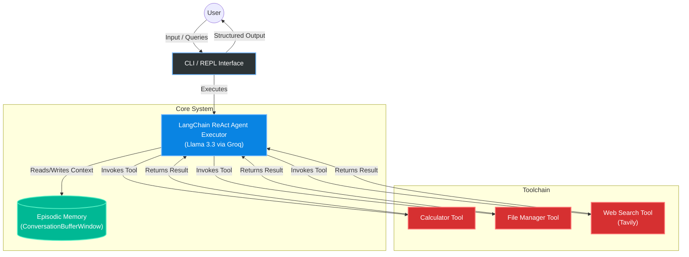

# Autonomous AI Agent (Groq + Llama 3.3)

A sophisticated, production-ready autonomous AI agent that can reason, plan, and execute tasks using a variety of tools, including a calculator, file system operations, and web search.

## Features

- **Advanced LLM Integration**: Utilizes **Llama 3.3 70B** (via Groq) for powerful reasoning capabilities.
- **Modular Tool System**: Supports three distinct toolsets:
    - **Calculator**: Solves complex mathematical expressions.
    - **File Manager**: Reads, writes, and lists files in the `files/` directory.
    - **Web Search**: Searches the internet using Tavily AI.
- **Smart Planning & Reasoning**: The agent can autonomously decide which tools to use and in what sequence to solve a problem.
- **Long-Term Memory**: Features an **Episodic Memory** system using FAISS and SQLite to remember past interactions and facts.
- **Conversational Interface**: A friendly command-line interface with history and markdown rendering.
- **Structured Logging**: Advanced logging with LangSmith integration for observability.

## Prerequisites

Ensure you have the following set up:

- **Python 3.10+**
- **Groq API Key**: Set the environment variable `GROQ_API_KEY`.
- **Tavily API Key**: Set the environment variable `TAVILY_API_KEY`.

## Installation

1.  **Clone the repository**:
    ```bash
    git clone <repository-url>
    cd Autonomous-AI-Agent
    ```

2.  **Create a virtual environment** (Recommended):
    ```bash
    python -m venv agentenv
    # On Windows:
    agentenv\Scripts\activate
    # On macOS/Linux:
    source agentenv/bin/activate
    ```

3.  **Install dependencies**:
    ```bash
    pip install -r requirements.txt
    ```

4.  **Verify Setup**:
    Run the included verification script to ensure your API keys are correctly configured:
    ```bash
    python setup_check.py
    ```

## Usage

Run the main application:

```bash
python main.py
```

### Available Commands

Inside the REPL, you can use:
- `quit` or `exit`: Close the application.
- `clear`: Clear the chat history.
- `history`: View the conversation history.
- **Type anything** to ask the agent to solve a problem or answer a question.

## Project Structure

- `main.py`: Entry point of the application.
- `setup_check.py`: Utility script to verify environment variables.
- `requirements.txt`: List of Python dependencies.
- `agentenv/`: Virtual environment (created during setup).
- `agent/`: Core agent logic and tools.
    - `model.py`: LLM configuration and agent definition.
    - `tools.py`: Definitions of calculator, file, and web tools.
    - `memory.py`: Implementation of FAISS vector store and SQLite memory.
- `files/`: Directory for file operations.

## System Architecture



## How to Run (Full Stack)

This project has been split into a Python FastAPI Backend and a React Frontend. You must run both servers simultaneously.

### 1. Start the Backend API
The backend provides the LangChain intelligence and session management.

1. Open a new terminal.
2. Navigate to the `agent_project` directory:
   ```bash
   cd agent_project
   ```
3. Install dependencies (if you haven't already):
   ```bash
   pip install -r requirements.txt
   ```
4. Start the FastAPI server using `uvicorn`:
   ```bash
   python -m uvicorn api:app --reload --port 8000
   ```
   *The backend is now running at `http://localhost:8000`.*

### 2. Start the Frontend UI
The frontend provides the modern React/Tailwind UI.

1. Open a **second** terminal.
2. Navigate to the `agent_UI` directory:
   ```bash
   cd agent_UI
   ```
3. Install the node modules:
   ```bash
   npm install
   ```
4. Start the development server:
   ```bash
   npm run dev
   ```
   *The frontend is now running at `http://localhost:5173`. Open this URL in your browser to start chatting with the agent!*
